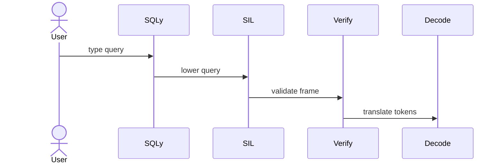

# SoulLanguage Documentation

Welcome to the SoulLanguage developer documentation. The project implements the
Machine-Spirit OSI stack. **SQLy** provides a friendly query language, **SIL**
verifies and decodes frames, and the runtime turns them into actions.

