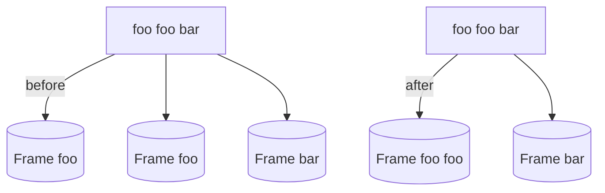

# SQLy Context-Batch Optimiser

The optimiser merges consecutive phrases that share the same context
metadata. In practice, identical phrases in a query are grouped into a
single phrase before lowering to SIL frames. This reduces the number of
frames transmitted without altering the query semantics.

