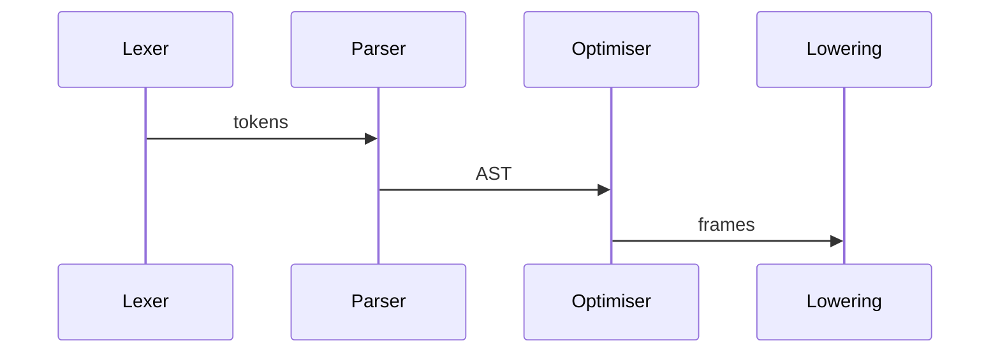

# SQLy Latency

The latency benchmark measures end-to-end compilation of a 5k word corpus.

```
$ pytest benchmarks/bench_latency.py -q
```

Example run on Python 3.12:

```
slow  = 0.030s
fast  = 0.023s
speed = 23%
```



